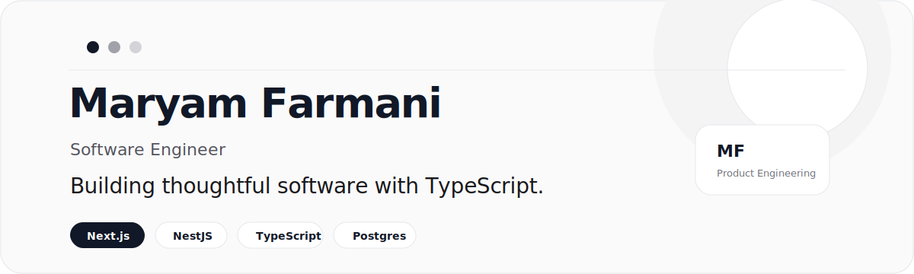
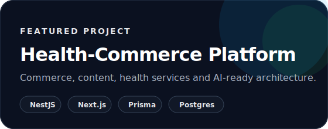
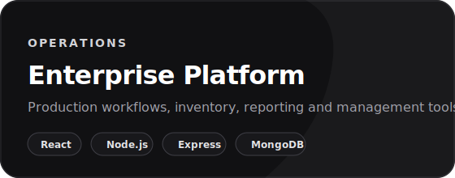

<picture>
  <source media="(prefers-color-scheme: dark)" srcset=".github/assets/hero-dark.svg">
  <source media="(prefers-color-scheme: light)" srcset=".github/assets/hero-light.svg">
  
</picture>

 

<a href="mailto:farmanimaryam01@gmail.com">Email</a>
&nbsp;&nbsp;·&nbsp;&nbsp;
<a href="https://linkedin.com/in/maryam-farmani">LinkedIn</a>
&nbsp;&nbsp;·&nbsp;&nbsp;
<a href="https://github.com/maryam-farmani">GitHub</a>

---

## About

I build web applications with a strong focus on architecture, maintainability and product quality.

My work combines backend engineering, frontend development and system design to create software that is practical to operate, straightforward to extend and comfortable for teams to maintain.

Recently, I have been working on enterprise platforms, digital health products and business applications using modern JavaScript and TypeScript technologies.

---

## What I am building

<table>
<tr>
<td width="50%">

### Health technology platforms

Digital products for healthcare, commerce, content and operational workflows.

</td>
<td width="50%">

### Enterprise web applications

Internal tools for production, inventory, reporting and business process management.

</td>
</tr>
<tr>
<td width="50%">

### Scalable backend services

API-first systems designed around clear boundaries, security and maintainability.

</td>
<td width="50%">

### AI-ready product architecture

Foundations prepared for recommendations, assistants, knowledge bases and automation.

</td>
</tr>
</table>

---

## Featured work

<table>
<tr>
<td width="50%">

### Health-Commerce Platform

A modular platform combining commerce, content management and digital health services.

**Selected capabilities**

- Modular backend architecture
- Authentication and authorization
- OTP authentication
- Role-based access control
- Product management
- Object storage
- API documentation
- AI-ready foundation

**Technology**

`Next.js` `NestJS` `PostgreSQL` `Prisma` `Redis` `Docker` `MinIO`

</td>
<td width="50%">

### Enterprise Operations Platform

Business platform supporting production workflows, inventory management and operational processes.

**Selected capabilities**

- Batch management
- Inventory workflows
- Reporting
- File management
- Access control
- Dashboard interfaces
- Operational process design

**Technology**

`React` `Node.js` `Express` `MongoDB` `REST API`

</td>
</tr>
</table>

---

## Engineering stack

<table>
<tr>
<td width="25%">

### Frontend

Next.js  
React  
TypeScript  
JavaScript  
Tailwind CSS  
Material UI

</td>
<td width="25%">

### Backend

NestJS  
Node.js  
Express  
REST APIs  
JWT  
RBAC  
Swagger

</td>
<td width="25%">

### Data

PostgreSQL  
Prisma ORM  
MongoDB  
Redis  
SQL  
Schema Design

</td>
<td width="25%">

### Infrastructure

Docker  
Linux  
MinIO  
Nginx  
GitHub Actions  
Git

</td>
</tr>
</table>

---

## Engineering principles

I value software that stays maintainable as products evolve.

That means choosing simple solutions when possible, writing code that communicates intent clearly and designing systems that teams can confidently build upon.

Technology changes quickly. Clear engineering decisions tend to last much longer.

---

## Current interests

- Backend architecture
- Product engineering
- Platform design
- Cloud infrastructure
- AI-assisted development
- Developer experience

---

## Contribution

  <picture>
    <source media="(prefers-color-scheme: dark)" srcset="https://raw.githubusercontent.com/maryam-farmani/maryam-farmani/output/github-contribution-grid-snake-dark.svg">
    <source media="(prefers-color-scheme: light)" srcset="https://raw.githubusercontent.com/maryam-farmani/maryam-farmani/output/github-contribution-grid-snake.svg">
    
  </picture>

---

## Contact

**Email**  
farmanimaryam01@gmail.com

**LinkedIn**  
https://linkedin.com/in/maryam-farmani

**GitHub**  
https://github.com/maryam-farmani

 

> Good software solves problems. Great software remains easy to improve.

